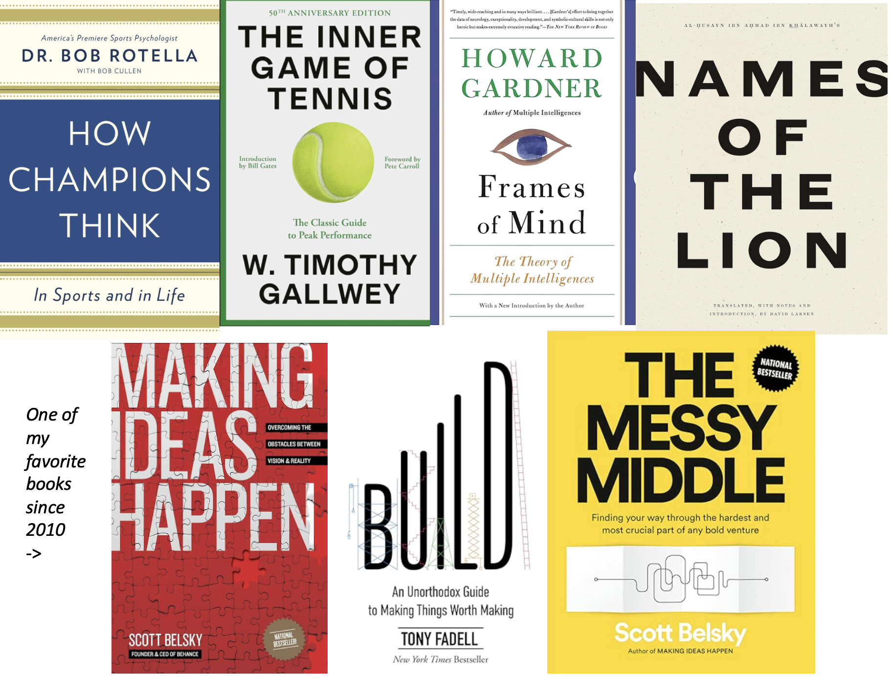
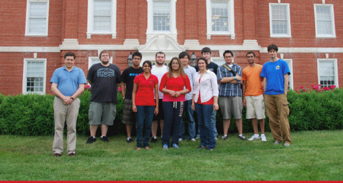
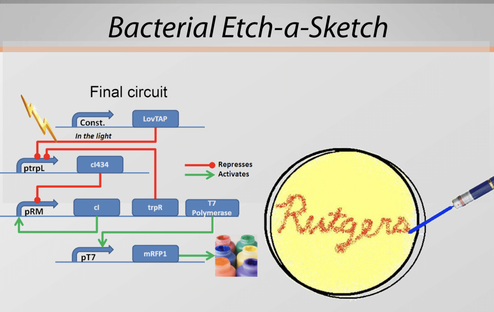
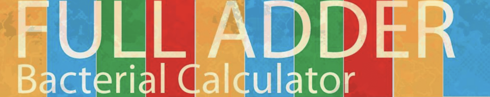
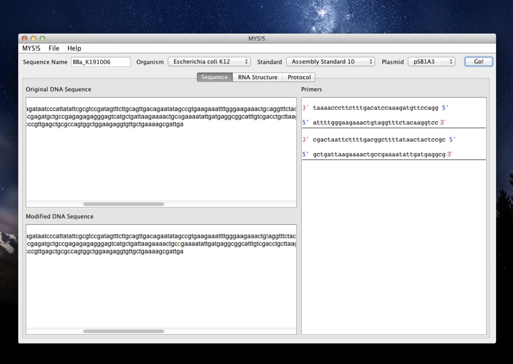
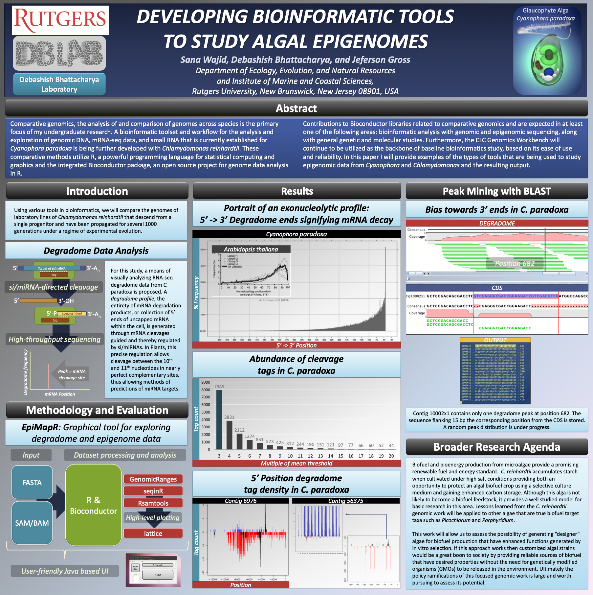
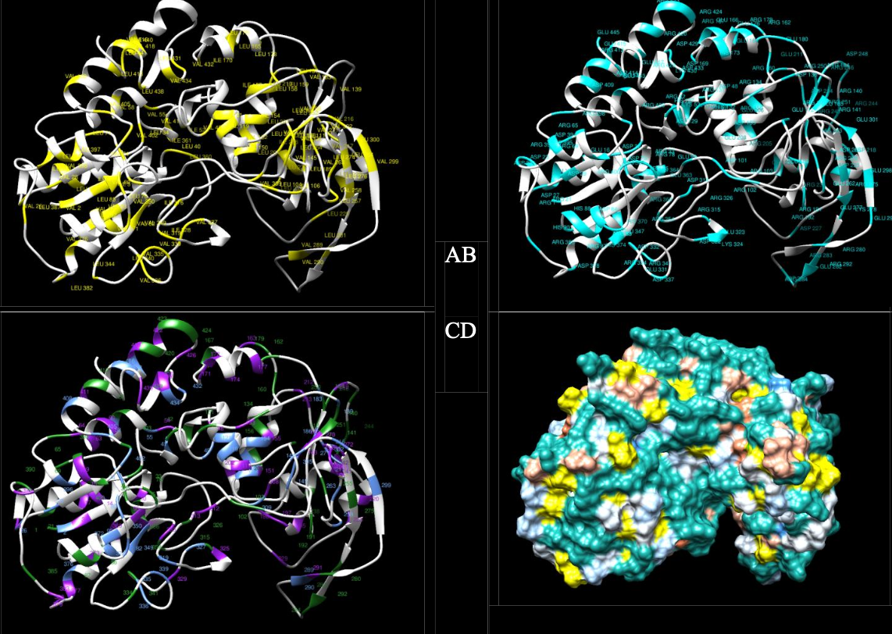
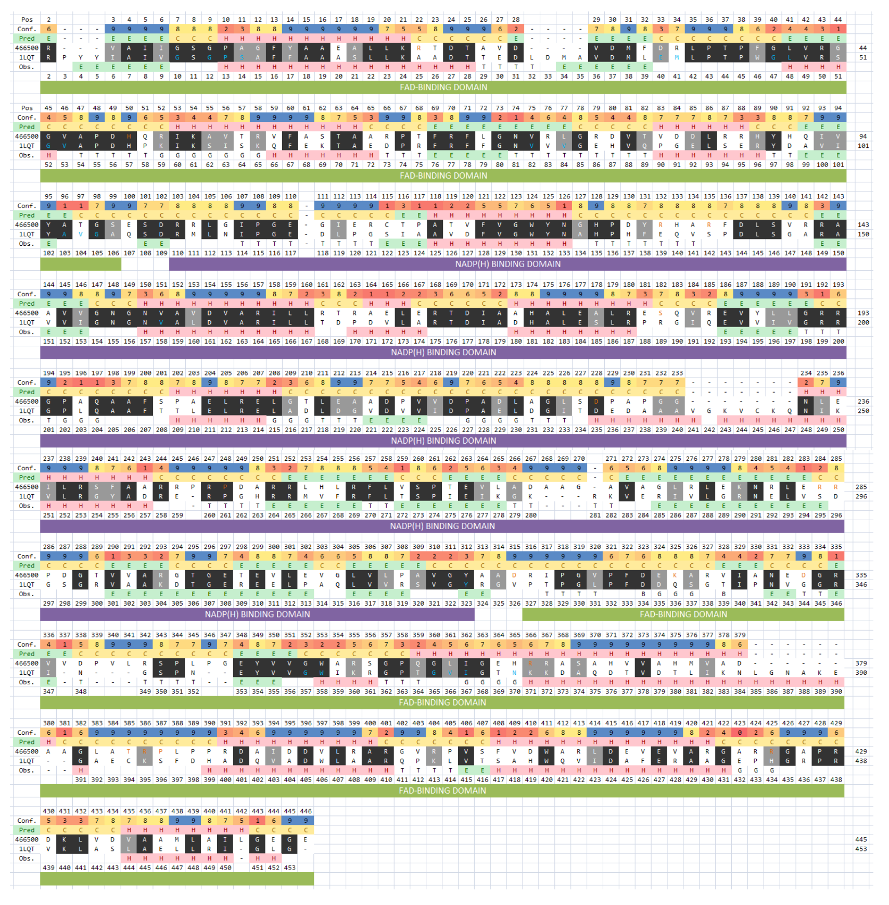

### Hi there 👋

<!--
**swajid/swajid** is a ✨ _special_ ✨ repository because its `README.md` (this file) appears on your GitHub profile.

Here are some ideas to get you started:

- 🔭 I’m currently working on ...
- 🌱 I’m currently learning ...
- 👯 I’m looking to collaborate on ...
- 🤔 I’m looking for help with ...
- 💬 Ask me about ...
- 📫 How to reach me: ...
- 😄 Pronouns: ...
- ⚡ Fun fact: ...
-->
# 📚 What I'm Currently Reading Or Re-Reading (Non-Fiction)

# 📊 Code
* [📑 `all_the_seqs_and_etc`](https://github.com/swajid/all_the_seqs_and_etc)
* [👩🏻‍💻 `Construct_partial_file_names_from_inexhaustive_excel_file_then_map_to_files_and_move_mapped_files`](https://github.com/swajid/Construct_partial_file_names_from_inexhaustive_excel_file_then_map_to_files_and_move_mapped_files)
* [🧬 `iGEM-Rutgers-Software`](https://github.com/swajid/iGEM-Rutgers-Software)
* [🧬 `Merge_topoffs_DNA_nexus`](https://github.com/swajid/Merge_topoffs_DNA_nexus)
* [🧬 `PacBio_Rename_All_Unique_Ids_To_Well_Names_From_XML`](https://github.com/swajid/PacBio_Rename_All_Unique_Ids_To_Well_Names_From_XML)
* [🗄️ `Pairwise File Comparisons`](https://github.com/herlog/pairwise-file-comparisons/)
* [🐍 `py-task-organizer`](https://github.com/swajid/py-task-organizer) (Summer & Fall 2024)
* [📑 `review_and_read_ahead`](https://github.com/swajid/review_and_read_ahead)
* [⭐️ `Rosalind_Project_Euler_LeetCode_Datacamp`](https://github.com/swajid/Rosalind_Project_Euler_LeetCode_Datacamp) (Summer & Fall 2024)
  * [`FIB_RabbitsAndRecurrenceRelations.py`](https://github.com/swajid/Rosalind_Project_Euler_LeetCode_Datacamp/blob/main/Rosalind/FIB/FIB_RabbitsAndRecurrenceRelations.py)

  * [`FRMT-DataFormats.py`](https://github.com/swajid/Rosalind_Project_Euler_LeetCode_Datacamp/blob/main/Rosalind/FRMT/FRMT-DataFormats.py)

  * [`GC_ComputingGCContent.py`](https://github.com/swajid/Rosalind_Project_Euler_LeetCode_Datacamp/blob/main/Rosalind/GC/GC_ComputingGCContent.py)

  * [`GRPH_OverlappingGraphs.py`](https://github.com/swajid/Rosalind_Project_Euler_LeetCode_Datacamp/blob/main/Rosalind/GRPH/GRPH_OverlappingGraphs.py)

  * [`IPRB-MendelsFirstLaw.py`](https://github.com/swajid/Rosalind_Project_Euler_LeetCode_Datacamp/blob/main/Rosalind/IPRB/IPRB-MendelsFirstLaw.py)

  * [`LEXF_EnumeratingK-mersLexicographically.py`](https://github.com/swajid/Rosalind_Project_Euler_LeetCode_Datacamp/blob/main/Rosalind/LEXF/LEXF_EnumeratingK-mersLexicographically.py)

  * [`LEXV_OrderingStringsOfVaryingLengthLexicographically.py`](https://github.com/swajid/Rosalind_Project_Euler_LeetCode_Datacamp/blob/main/Rosalind/LEXV/LEXV_OrderingStringsOfVaryingLengthLexicographically.py)

  * [`PROT-TranslatingRNAIntoProtein.py`](https://github.com/swajid/Rosalind_Project_Euler_LeetCode_Datacamp/blob/main/Rosalind/PROT/PROT-TranslatingRNAIntoProtein.py)

  * [`PRTM-Calculating_Protein_Mass.py`](https://github.com/swajid/Rosalind_Project_Euler_LeetCode_Datacamp/blob/main/Rosalind/PRTM/PRTM-Calculating_Protein_Mass.py)

  * [`REVP_LocatingRestrictionSites.py`](https://github.com/swajid/Rosalind_Project_Euler_LeetCode_Datacamp/blob/main/Rosalind/REVP/REVP_LocatingRestrictionSites.py)

  * [`SUBS-FindAMotifInDNA.py`](https://github.com/swajid/Rosalind_Project_Euler_LeetCode_Datacamp/blob/main/Rosalind/SUBS/SUBS-FindAMotifInDNA.py)

  * [`TFSQ_FASTQFormatIntroduction.py`](https://github.com/swajid/Rosalind_Project_Euler_LeetCode_Datacamp/blob/main/Rosalind/TFSQ/TFSQ_FASTQFormatIntroduction.py)

  * [`Euler_1.py`](https://github.com/swajid/Rosalind_Project_Euler_LeetCode_Datacamp/blob/main/Project_Euler/001/Euler_1.py)

  * [`Euler_1.rs`](https://github.com/swajid/Rosalind_Project_Euler_LeetCode_Datacamp/blob/main/Project_Euler/001/Euler_1.rs)

  * [`Euler_5.py`](https://github.com/swajid/Rosalind_Project_Euler_LeetCode_Datacamp/blob/main/Project_Euler/005/Euler_5.py)

  * [`Euler_5.rs`](https://github.com/swajid/Rosalind_Project_Euler_LeetCode_Datacamp/blob/main/Project_Euler/005/Euler_5.rs)

* [👩🏻‍💻 `rust-math-camp`](https://github.com/swajid/rust-math-camp)
* [🦀 `rusty-task-organizer`](https://github.com/swajid/rusty-task-organizer)
* [🧬 `streamlit-bioinformatics-tools`](https://app-bioinformatics-tools.streamlit.app/) (Summer & Fall 2024)
* [🧬 `treeSortR`](https://github.com/swaijd-rtg/treeSortR) (2013-2014)
* 🧬 `Unified_Taxonomic_Classifier` (Fall 2024)

# 📚 Scientific and Technical Writing
* [👩🏻‍💻 *Two ways to get started with `diff` for bioinformatics: using Python and also Excel to output a Bash shell script with pairwise file comparisons,* herlog.com. August 27, 2023](https://www.herlog.com/two-ways-to-get-started-with-diff-for-bioinformatics-using-python-and-excel-to-output-a-shell-script-with-pairwise-comparisons/)
* [📑 *General guidelines and understandings for handing off data to another team precisely every time*, herlog.com. October 8, 2023](https://www.herlog.com/some-general-guidelines-and-understandings-for-handing-off-data-to-another-team-precisely-every-time/)
* [👩🏻‍💻 *Getting started with `screen` for bioinformaticians*, herlog.com. December 17, 2023](https://www.herlog.com/getting-started-with-screen-for-bioinformaticians/)

* [🧬 *Calculating concordance in Illumina's Genome Studio 2.0*, herlog.com. October 27, 2023](https://www.herlog.com/calculating-concordance-in-genomestudio-2-0/)

* [🧬 *The value of DTC ancestry DNA kits and where they are made illegal and possibly why*, herlog.com. January 18, 2024](https://www.herlog.com/the-value-of-dtc-ancestry-dna-kits-and-where-they-are-made-illegal-and-possibly-why/)

* [🧬 *Structure-function relationship of FAD-dependent pyridine nucleotide-disulfide oxidoreductase in *Anaeromyxobacter dehalogenans* 2CP-C reveals perhaps, a unique mechanism for transferring reducing equivalents*, (Cross-listed) Second-Year (Level 600) Graduate Level Course: *Homology Modeling of Proteins* Final Paper, Course Grade: A, December 20, 2013](swajid-2013-Homology-Modeling-Final.pdf)

# 🏆 Certificates
* [👩🏻‍💻 Introduction to Computational Thinking and Data Science, MITx, December 23, 2014](https://verify.edx.org/cert/aa83389ceceb4ae38eb4c93cba4f84be) <!-- (https://s3.amazonaws.com/verify.edx.org/downloads/3e60269af98e4422a80f6d1375d391f7/Certificate.pdf) -->
* [👩🏻‍💻 Introduction to Computer Science and Programming Using Python, MITx, October 31, 2014](https://verify.edx.org/cert/5d9a5a822b324d9598a41abfe7579fb3) <!--(https://s3.amazonaws.com/verify.edx.org/downloads/98d0824c8c5340d29fcc121b0596c87b/Certificate.pdf) -->
* [🧬 Quantitative Biology Workshop, MITx, August 1, 2014](https://verify.edx.org/cert/98e36083a1f54d24a983362010aa15a4) <!-- (https://s3.amazonaws.com/verify.edx.org/downloads/131c804ac0724b57bcabbb995c66cea0/Certificate.pdf) -->

# 📌 Posters
## 🦠 Rutgers iGEM 2011: *Complex Circuits In Synthetic Biology* - Team Founder and Team Leader (Both: Synthetic Biology Wet-lab & Synthetic Biology Software)
## ⚙️ Rutgers GEARS: *Genetic Engineering at Rutgers Society* - Founder and President

## 🧬 Rutgers Bhattacharya Algal Genomics Lab - Bioinformaticist (Jan 2012 - May 2014)

## 🧬 Rutgers Structural Biology Computational Lab - Homology Protein Modeling - Student Researcher (2011 - 2015)

# 🗃️ Papers
* [Google Scholar](https://scholar.google.com/citations?user=FdoMHg8AAAAJ&hl=en&oi=ao)

`I dedicate all of my work and everything good I have done and will ever do to my parents, who are intelligent, wise, funny, honest and hard-working people that have taught me, by example, to pay serious attention to the details in everything I do. I have always done all of my work, all by myself. My work is my power and I, as I always have done, take pride in it.`

# [📸](https://www.instagram.com/imsanawaji/) [🐤](https://twitter.com/imsanaw) [☁️](https://bsky.app/profile/herlog.com) [💻](https://rosalind.info/users/imsanaw/)
