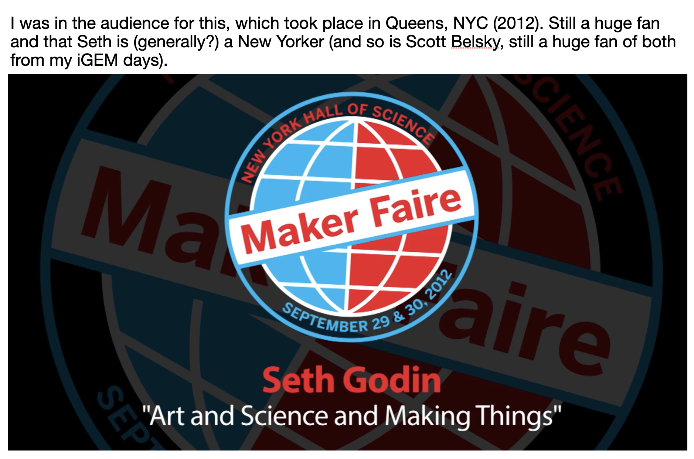
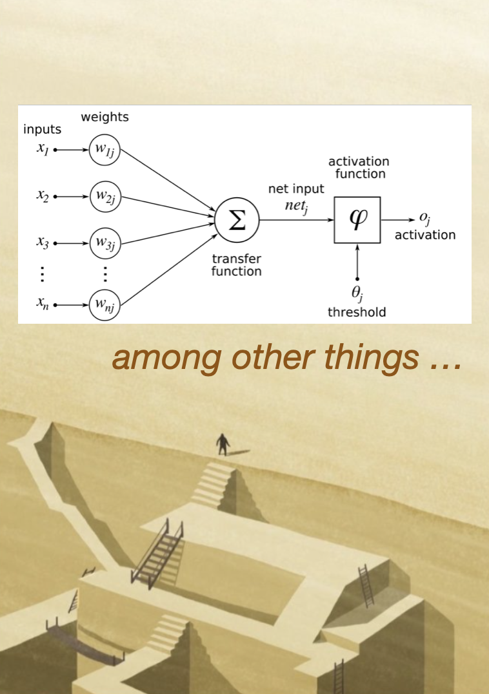
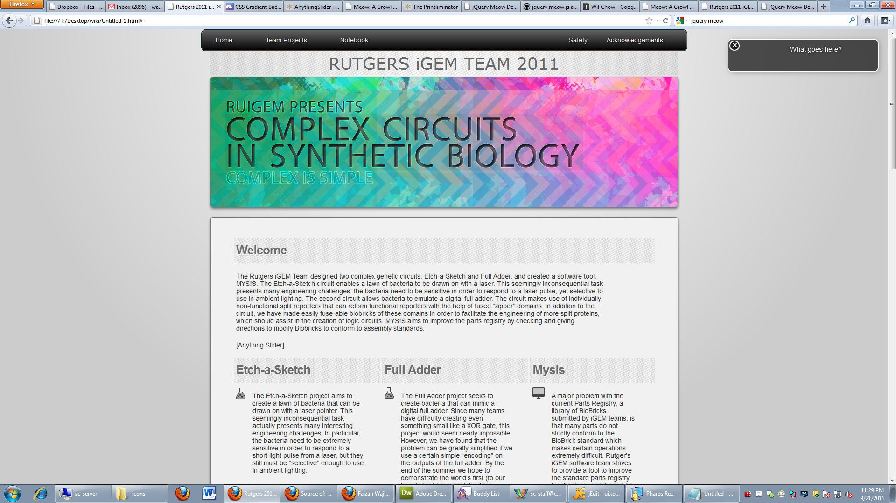
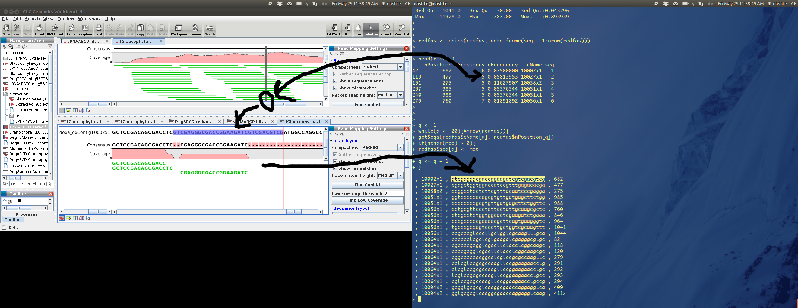
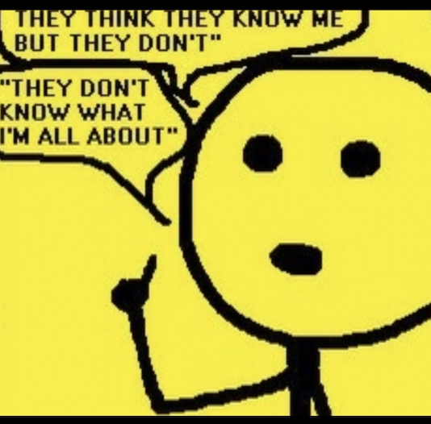

### Hi there 👋

<!--
**swajid/swajid** is a ✨ _special_ ✨ repository because its `README.md` (this file) appears on your GitHub profile.

Here are some ideas to get you started:

- 🔭 I’m currently working on ...
- 🌱 I’m currently learning ...
- 👯 I’m looking to collaborate on ...
- 🤔 I’m looking for help with ...
- 💬 Ask me about ...
- 📫 How to reach me: ...
- 😄 Pronouns: ...
- ⚡ Fun fact: ...
-->
# 📚 What I'm Currently Reading Or Re-Reading (Non-Fiction)

# 📊 Code
## `current projects`
* [⚓️ `odyssee-julia-notebooks` (Summer 2026)](https://github.com/swajid/odyssee-julia-notebooks)

  
* [⚓️ `Cancer-Computational-Biology-Notes-And-Code_Review-And-Read-Ahead_[2024/2025, ∞)`](https://github.com/swajid/Cancer-Computational-Biology-Notes-And-Code_Review-And-Read-Ahead_2025-Ongoing)

## `else`
* [📑 `all_the_seqs_and_etc`](https://github.com/swajid/all_the_seqs_and_etc)
* [👩🏻‍💻 `Construct_partial_file_names_from_inexhaustive_excel_file_then_map_to_files_and_move_mapped_files`](https://github.com/swajid/Construct_partial_file_names_from_inexhaustive_excel_file_then_map_to_files_and_move_mapped_files)
* [🧬 `iGEM-Rutgers-Software`](https://github.com/swajid/iGEM-Rutgers-Software)
* [🧬 `Merge_topoffs_DNA_nexus`](https://github.com/swajid/Merge_topoffs_DNA_nexus)
* [🧬 `PacBio_Rename_All_Unique_Ids_To_Well_Names_From_XML`](https://github.com/swajid/PacBio_Rename_All_Unique_Ids_To_Well_Names_From_XML)
* [🗄️ `Pairwise File Comparisons`](https://github.com/herlog/pairwise-file-comparisons/)
* [🐍 `py-task-organizer`](https://github.com/swajid/py-task-organizer) (Summer & Fall 2024)
* [📑 `review_and_read_ahead`](https://github.com/swajid/review_and_read_ahead)
* [⭐️ `Rosalind_Project_Euler_LeetCode_Datacamp`](https://github.com/swajid/Rosalind_Project_Euler_LeetCode_Datacamp) (Summer & Fall 2024)
  * [`FIB_RabbitsAndRecurrenceRelations.py`](https://github.com/swajid/Rosalind_Project_Euler_LeetCode_Datacamp/blob/main/Rosalind/FIB/FIB_RabbitsAndRecurrenceRelations.py)

  * [`FRMT-DataFormats.py`](https://github.com/swajid/Rosalind_Project_Euler_LeetCode_Datacamp/blob/main/Rosalind/FRMT/FRMT-DataFormats.py)

  * [`GC_ComputingGCContent.py`](https://github.com/swajid/Rosalind_Project_Euler_LeetCode_Datacamp/blob/main/Rosalind/GC/GC_ComputingGCContent.py)

  * [`GRPH_OverlappingGraphs.py`](https://github.com/swajid/Rosalind_Project_Euler_LeetCode_Datacamp/blob/main/Rosalind/GRPH/GRPH_OverlappingGraphs.py)

  * [`IPRB-MendelsFirstLaw.py`](https://github.com/swajid/Rosalind_Project_Euler_LeetCode_Datacamp/blob/main/Rosalind/IPRB/IPRB-MendelsFirstLaw.py)

  * [`LEXF_EnumeratingK-mersLexicographically.py`](https://github.com/swajid/Rosalind_Project_Euler_LeetCode_Datacamp/blob/main/Rosalind/LEXF/LEXF_EnumeratingK-mersLexicographically.py)

  * [`LEXV_OrderingStringsOfVaryingLengthLexicographically.py`](https://github.com/swajid/Rosalind_Project_Euler_LeetCode_Datacamp/blob/main/Rosalind/LEXV/LEXV_OrderingStringsOfVaryingLengthLexicographically.py)

  * [`PROT-TranslatingRNAIntoProtein.py`](https://github.com/swajid/Rosalind_Project_Euler_LeetCode_Datacamp/blob/main/Rosalind/PROT/PROT-TranslatingRNAIntoProtein.py)

  * [`PRTM-Calculating_Protein_Mass.py`](https://github.com/swajid/Rosalind_Project_Euler_LeetCode_Datacamp/blob/main/Rosalind/PRTM/PRTM-Calculating_Protein_Mass.py)

  * [`REVP_LocatingRestrictionSites.py`](https://github.com/swajid/Rosalind_Project_Euler_LeetCode_Datacamp/blob/main/Rosalind/REVP/REVP_LocatingRestrictionSites.py)

  * [`SUBS-FindAMotifInDNA.py`](https://github.com/swajid/Rosalind_Project_Euler_LeetCode_Datacamp/blob/main/Rosalind/SUBS/SUBS-FindAMotifInDNA.py)

  * [`TFSQ_FASTQFormatIntroduction.py`](https://github.com/swajid/Rosalind_Project_Euler_LeetCode_Datacamp/blob/main/Rosalind/TFSQ/TFSQ_FASTQFormatIntroduction.py)

  * [`Euler_1.py`](https://github.com/swajid/Rosalind_Project_Euler_LeetCode_Datacamp/blob/main/Project_Euler/001/Euler_1.py)

  * [`Euler_1.rs`](https://github.com/swajid/Rosalind_Project_Euler_LeetCode_Datacamp/blob/main/Project_Euler/001/Euler_1.rs)

  * [`Euler_5.py`](https://github.com/swajid/Rosalind_Project_Euler_LeetCode_Datacamp/blob/main/Project_Euler/005/Euler_5.py)

  * [`Euler_5.rs`](https://github.com/swajid/Rosalind_Project_Euler_LeetCode_Datacamp/blob/main/Project_Euler/005/Euler_5.rs)

* [👩🏻‍💻 `rust-math-camp`](https://github.com/swajid/rust-math-camp)
* [🦀 `rusty-task-organizer`](https://github.com/swajid/rusty-task-organizer)
* [🧬 `streamlit-bioinformatics-tools`](https://app-bioinformatics-tools.streamlit.app/) (Summer & Fall 2024)
* [🧬 `treeSortR`](https://github.com/swaijd-rtg/treeSortR) (2013-2014)
* 🧬 `Unified_Taxonomic_Classifier` (Fall 2024)

# 📚 (Soon: Computational), Scientific and Technical Writing
* [💉 *From Obesity Drug Design to System Design: Pairing GLP-1s With Metabolic AI Digital Twins,* herlog.com. February 17, 2026 ](https://www.herlog.com/from-obesity-drug-design-to-system-design-pairing-glp-1s-with-metabolic-ai-digital-twins/)

* [👩🏻‍💻 *Two ways to get started with `diff` for bioinformatics: using Python and also Excel to output a Bash shell script with pairwise file comparisons,* herlog.com. August 27, 2023](https://www.herlog.com/two-ways-to-get-started-with-diff-for-bioinformatics-using-python-and-excel-to-output-a-shell-script-with-pairwise-comparisons/)
* [📑 *General guidelines and understandings for handing off data to another team precisely every time*, herlog.com. October 8, 2023](https://www.herlog.com/some-general-guidelines-and-understandings-for-handing-off-data-to-another-team-precisely-every-time/)
* [👩🏻‍💻 *Getting started with `screen` for bioinformaticians*, herlog.com. December 17, 2023](https://www.herlog.com/getting-started-with-screen-for-bioinformaticians/)

* [🧬 *Calculating concordance in Illumina's Genome Studio 2.0*, herlog.com. October 27, 2023](https://www.herlog.com/calculating-concordance-in-genomestudio-2-0/)

* [🧬 *The value of DTC ancestry DNA kits and where they are made illegal and possibly why*, herlog.com. January 18, 2024](https://www.herlog.com/the-value-of-dtc-ancestry-dna-kits-and-where-they-are-made-illegal-and-possibly-why/)

* [🧬 *Structure-function relationship of FAD-dependent pyridine nucleotide-disulfide oxidoreductase in *Anaeromyxobacter dehalogenans* 2CP-C reveals perhaps, a unique mechanism for transferring reducing equivalents*, (Cross-listed) Second-Year (Level 600) Graduate Level Course: *Homology Modeling of Proteins* Final Paper, Course Grade: A, December 20, 2013](swajid-2013-Homology-Modeling-Final.pdf)

* [🧬 *Synthesizing a novel genetic sequential logic circuit: a push-on push-off switch*](bistableswitch-sw-seminar-f11.pdf) , Presented for course, "Seminar in Biotechnology" (126:401), Fall 2011, Final Grade: A

* [🧬 *Complex Circuits in Synthetic Biology: The Bacterial Full Adder*](bacterialfulladder-sw-seminar-f11.pdf) , Presented for (Final Yr level) course, "Seminar in Biotechnology" (126:401), Fall 2011, Final Grade: A (again, names listed were of the presentation order in the conference in Oct 2011, I was the Team Founder & Leader (by the way, in fact, I probably still am the Team Founder & Team Leader, it depends on who you ask.))

* [🧬 *Synthetic Biology: Helping to build marvelous microbes of the future*](synbiology-mmicrobes-sw-clqm-f11.pdf) , Presented for course, "Biochemistry (Final Yr level) Colloquium: Marvelous Microbes" (015:429), Spring 2012, Final Grade: A

# 🏆 Certificates
* [👩🏻‍💻 Introduction to Computational Thinking and Data Science, MITx, December 23, 2014](https://verify.edx.org/cert/aa83389ceceb4ae38eb4c93cba4f84be) <!-- (https://s3.amazonaws.com/verify.edx.org/downloads/3e60269af98e4422a80f6d1375d391f7/Certificate.pdf) -->
* [👩🏻‍💻 Introduction to Computer Science and Programming Using Python, MITx, October 31, 2014](https://verify.edx.org/cert/5d9a5a822b324d9598a41abfe7579fb3) <!--(https://s3.amazonaws.com/verify.edx.org/downloads/98d0824c8c5340d29fcc121b0596c87b/Certificate.pdf) -->
* [🧬 Quantitative Biology Workshop, MITx, August 1, 2014](https://verify.edx.org/cert/98e36083a1f54d24a983362010aa15a4) <!-- (https://s3.amazonaws.com/verify.edx.org/downloads/131c804ac0724b57bcabbb995c66cea0/Certificate.pdf) -->

# 📌 Posters
## 🦠 Rutgers iGEM 2011: *Complex Circuits In Synthetic Biology* - Team Founder and Team Leader (Both: Synthetic Biology Wet-lab & Synthetic Biology Software)
## ⚙️ Rutgers GEARS: *Genetic Engineering at Rutgers Society* - Founder and President

## 🧬 Rutgers Bhattacharya Algal Genomics Lab - Bioinformaticist (Jan 2012 - May 2014)

## My Ubuntu setup (On my personal laptop (these were not clinical NGS data))

## 🧬 Rutgers Structural Biology Computational Lab - Homology Protein Modeling - Student Researcher (2011 - 2015)

# 🗃️ Papers
* [Google Scholar](https://scholar.google.com/citations?user=FdoMHg8AAAAJ&hl=en&oi=ao)

# It is so important to 1. stand on your own two feet 2. keep standing on your own two feet (as my mom & dad raised me)

`I dedicate all of my work and everything good I have done and will ever do to my parents, who are intelligent, wise, funny, honest and hard-working people that have taught me, by example, to pay serious attention to the details in everything I do. I have always done all of my work, all by myself. My work is my power and I, as I always have done, take pride in it.`

`"People always come up to me and ask me, how am I so patient with my students and people I'm managing and I tell them, I learned it by having to be patient with my parents." & "Stop chasing small fry projects in ML/AI, think bigger (in terms of ML/AL math/cs etc)." - my brother`

`"this instrument/measurement tool (in his office) is made by a small company in Germany, and they are so good, that no company could compete with them or buy them out bc they could not re-create that machine to this day." - my eye doctor i.e. be so good that they can't 1. compete with you 2. buy you out -> all because the focus is on patients, helping patients.`

<!-- i'm always working, i've always been working since hs & i barely watch tv anymore & i barely hang out with ppl outside of family bc i really dont trust them. im always reading (non-fiction), writing, w/e i have to do to stay current & ahead. so, if you're only working 5 days a week, i can out work you. if you're only working 6 days a week (i.e. you have a sabbatical of some sorts on saturdays), i can out work you too. don't play no game that i cant win. oh and before i have to show you that i can out-work you, i was already able to out-think you, bc im always thinking too, productively too. now are we on the same page here? ok! good! those are not even my favorite parts about myself, i can out-wit you, i can out-class you. people like me and i dont have to force it or fake it. i can stand on my own two feet so i dont have to fold like origami for anyone. dont ever forget who it was you picked a fight with. i dont bar hop in brooklyn, never did that, dont know anything around me/went to hs with that im still friends with, that would do that, never will, absolutely not. i dont waste time like that. so look at me & look at u now. -->

# [📸](https://www.instagram.com/imsanawaji/) [🐤](https://twitter.com/imsanaw) [☁️](https://bsky.app/profile/herlog.com) [💻](https://rosalind.info/users/imsanaw/)
* [Public Dropbox from undergrad](https://www.dropbox.com/scl/fo/wldb8lg9kg14fn1ftisf8/ACxALV7sNphC8c1-Cd7pHKc?rlkey=rktakv0ddy1caxp6452ft7m7c&e=1&st=5tn5k71v&dl=0) <!-- with timestamps -->
* [Public Stackoverflow account, started/made in undergrad](https://stackoverflow.com/users/2005192/laemtao)

(Will update this with the actual picture but ...) A picture of my late-grandfather, dressed up as he usually would, who passed away in the mid-90s. Back then, you would get your blood glucose reading once a month and your doctor would review it with you, but that **one reading** was **a month old**. How things have changed in science in such, one could argue, a short amount of time, is what makes and keeps me optimistic.

Another story. [My brother's friend from hs](https://nyulangone.org/doctors/1013320423/paawan-v-punjabi) mastered ... and I mean, mastered, spanish on duolingo (during med school too), because he anticipated having patients who would speak spanish.

I really & truly believe, that the greatest achievement anyone can achieve, anywhere in the world, is not money or followers etc., but if someone else can say about that person "i trust my life with this person." (my brother has said this about one of his friends in grad school) (i.e. they have good judgement & they have good character, they're honest, when no one is looking they do the right thing etc.)" and that could be some very poor person somewhere in the world, doesn't matter.

# [treasure ur attention, companies are trying/fighting to take it away from you](https://www.instagram.com/reel/DYVRDyDlRh8/)

`"they said i was so finished, i told 'em its show business"  - lupe fiasco <3`

`"everything i'm not, made me everything i am - old kanye (album: "graduation")`

`"a vector doesn't care where it starts — only that it has a direction and refuses to stop; setbacks just change the arrow, never the fact that it's still moving."`
